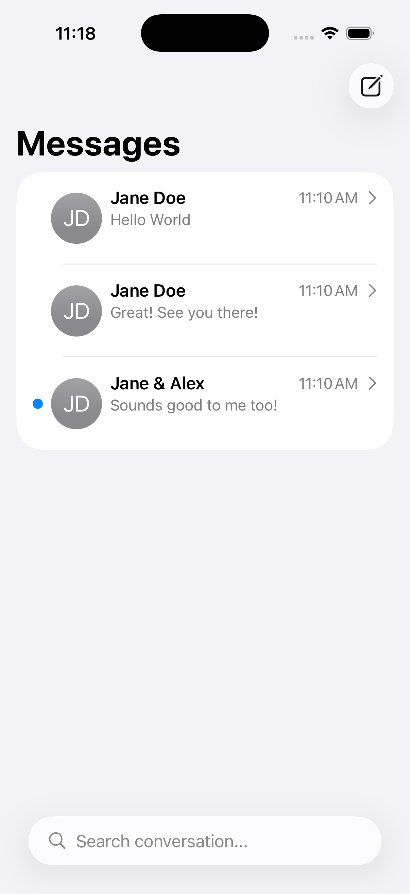
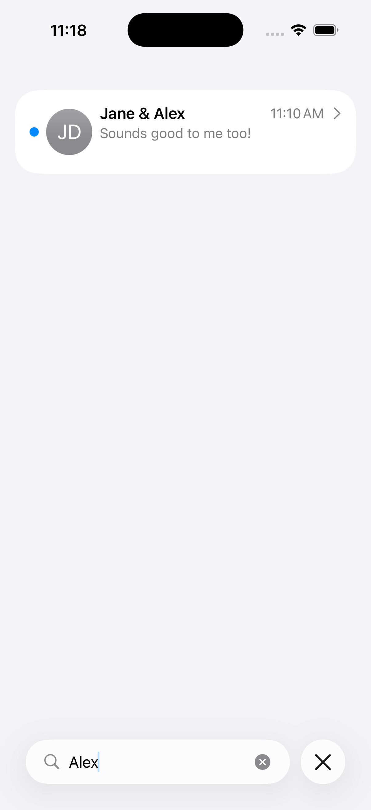
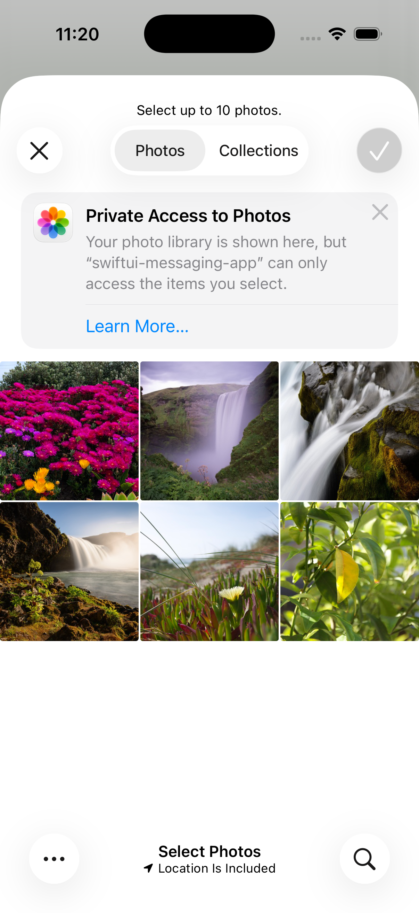
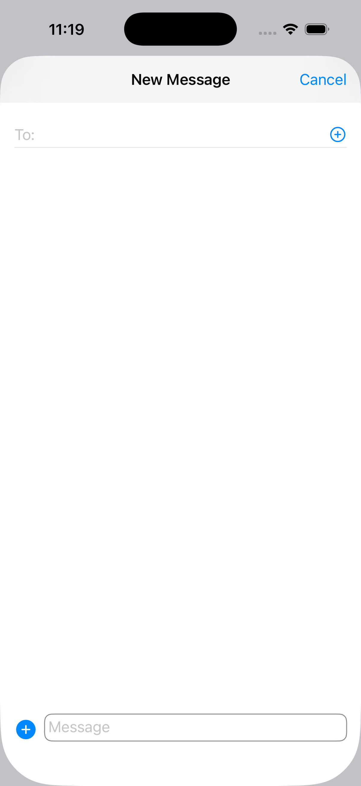

# SwiftUI Messaging App

A SwiftUI UI prototype for a messaging experience. This project focuses on layout, navigation, and component composition using mock data and a simple App Coordinator.

## Purpose
- Demonstrate a Coordinator-based navigation flow in SwiftUI
- Showcase chat-style UI components and layouts
- Explore search, swipe actions, and attachment UI patterns

## Highlights
- Conversation list with search and swipe actions
- Conversation details screen for message layout presentation
- Message composer and attachments UI
- Modular components and view models for UI state

## Tech Stack
- SwiftUI
- Coordinator pattern + `NavigationStack`
- Mock data layer (models + `MockedData`)
- Xcode (iOS)

## Screenshots

| Conversations | Search |
| --- | --- |
|  |  |
| Attachments | New Message |
|  |  |

## Run Locally
1. Open `swiftui-messaging-app/swiftui-messaging-app.xcodeproj` in Xcode.
2. Select an iOS simulator.
3. Run.
